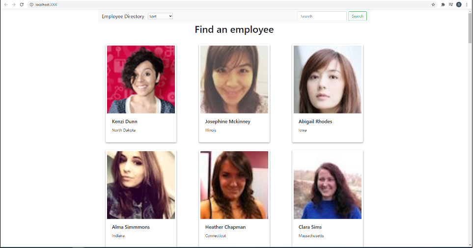

# Unit 20 React Homework: Employee Directory

## Overview

* As a user, I want to be able to view my entire employee directory at once so that I have quick access to their information.

## Business Context

An employee or manager would benefit greatly from being able to view non-sensitive data about other employees. It would be particularly helpful to be able to filter employees by name.

The user will be able to:

  * Sort the table by location or names alphabetized

  * Filter the users by first name.

